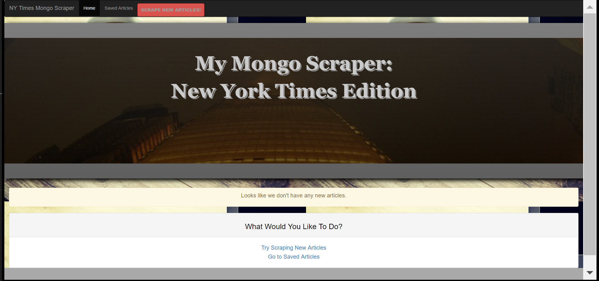

# ScraperSite
A web app that lets users view and leave comments on the latest news. 

With the use of:
express
express-handlebars
mongoose
body-parser
cheerio
request

to build a site where users can scrape articles from the New York Times. Then save articles of interest and add/delete notes on the articles.

on first load of the site the user is present with 

