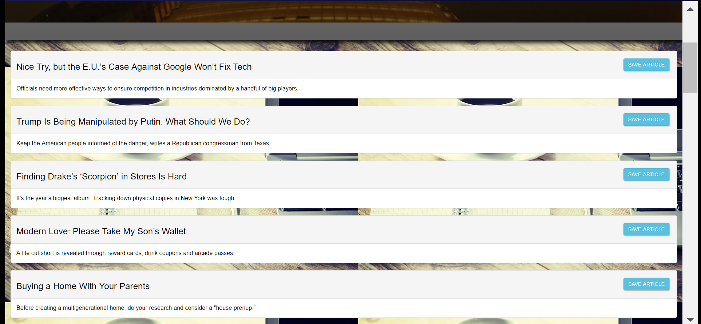
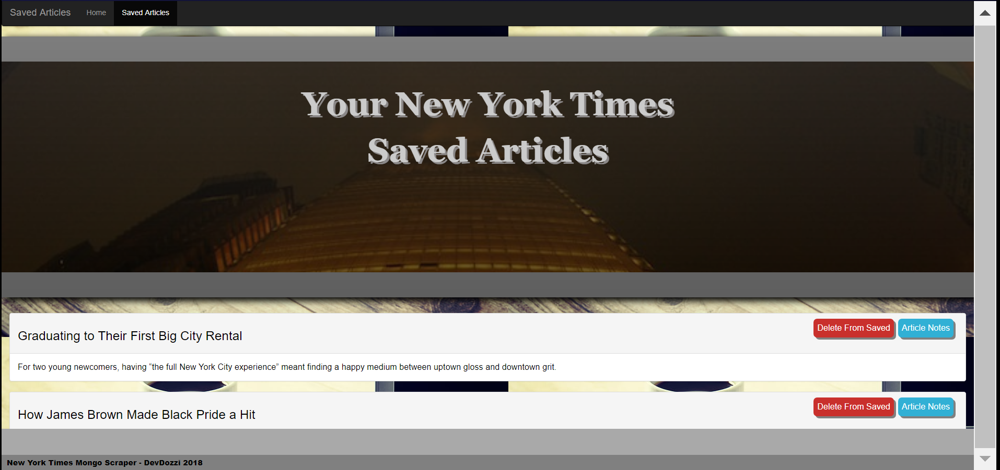
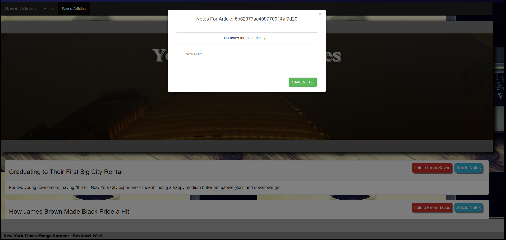

# ScraperSite
A web app that lets users view and leave comments on the latest news. 

With the use of:
express
express-handlebars
mongoose
body-parser
cheerio
request

to build a site where users can scrape articles from the New York Times. Then save articles of interest and add/delete notes on the articles.

on first load of the site the user is present with 

from here the user can scrape articles that are displayed on the home route

once saved, the user can go to the saved articles tab and view all the articles they have saved. 
Articles can also be deleted from here.

the user also has the ability to add notes to their saved articles

lastly, the user can delete a note if they no longer want to save that info to the article

